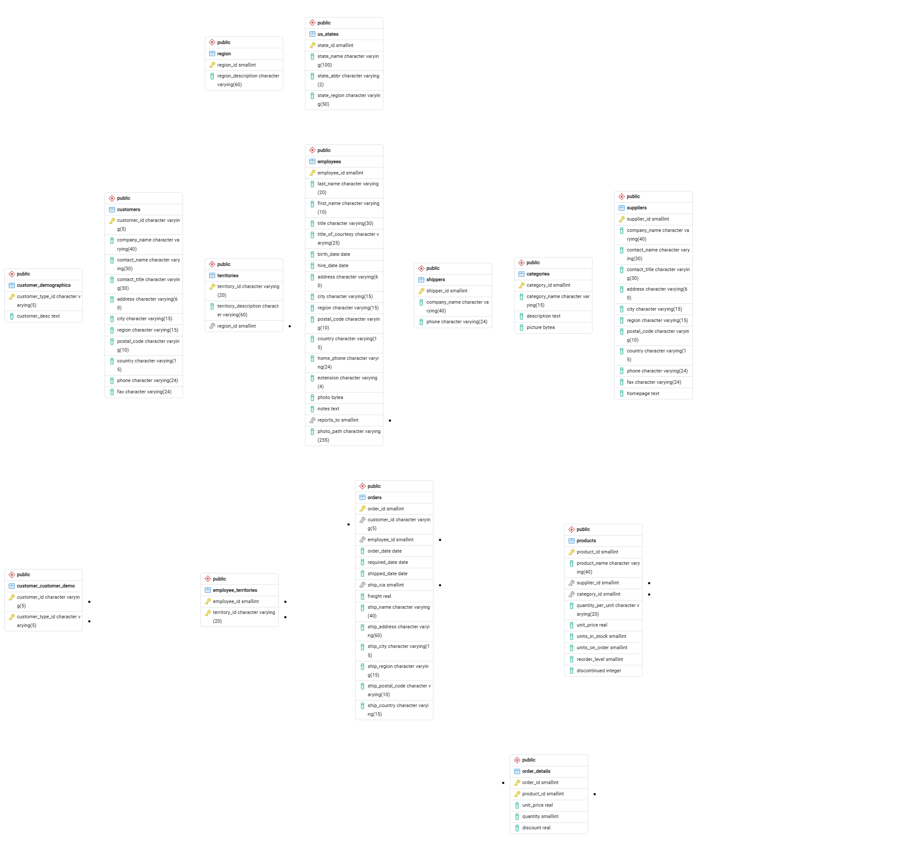

# Práctica SQL — Northwind

**Autor:** César Camacho 
**PostgreSQL:** 18  
**pgAdmin:** 4

Este repositorio contiene la base de datos Northwind y las soluciones de los 20 ejercicios de la práctica SQL.

## Cómo reproducir la práctica

1. Abre pgAdmin y crea una base de datos llamada `northwind`.
2. Selecciona esa base de datos y abre **Query Tool**.
3. Abre el archivo `northwind.sql` y ejecútalo para crear las tablas y cargar los datos.
4. Abre `prsctica.sql` en **Query Tool** y ejecuta las consultas que quieras comprobar. Los resultados y una breve explicación de cada ejercicio están en [respuestas.md](respuestas.md).

## Diagrama entidad–relación

## Índice

- [Respuestas de los 20 ejercicios](respuestas.md)
